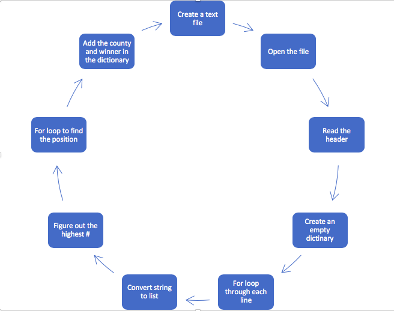

# Presidential-Race-2016
CS22A- Python Project
Dec 2018

I designed a Python code that will help determine the winner of the Presidential Race 2016 for each county in California and Delaware. Before writing our source code, we created a flowchart demonstrating the necessary steps to be taken to output the correct candidate for each county in each state as shown below.

